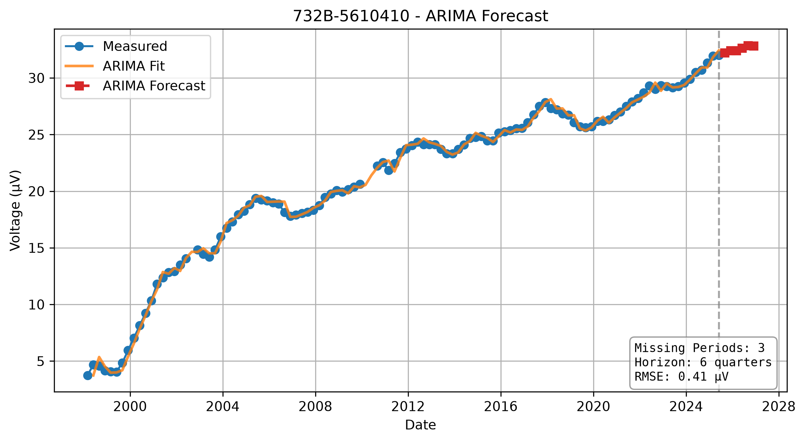
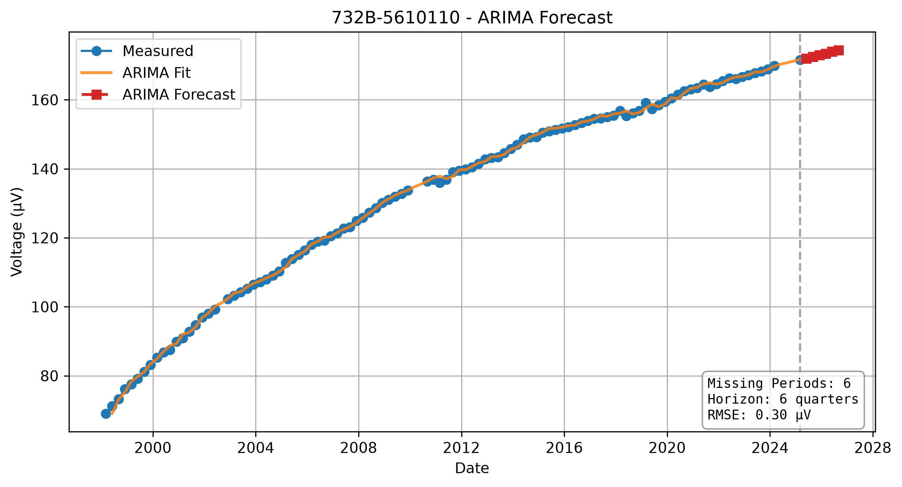
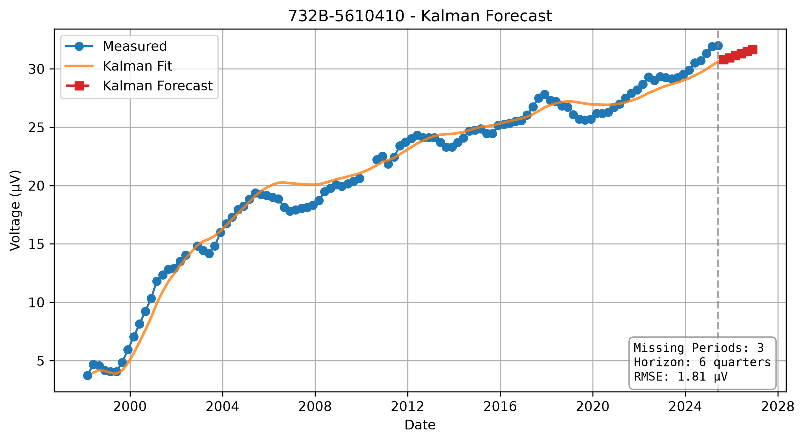
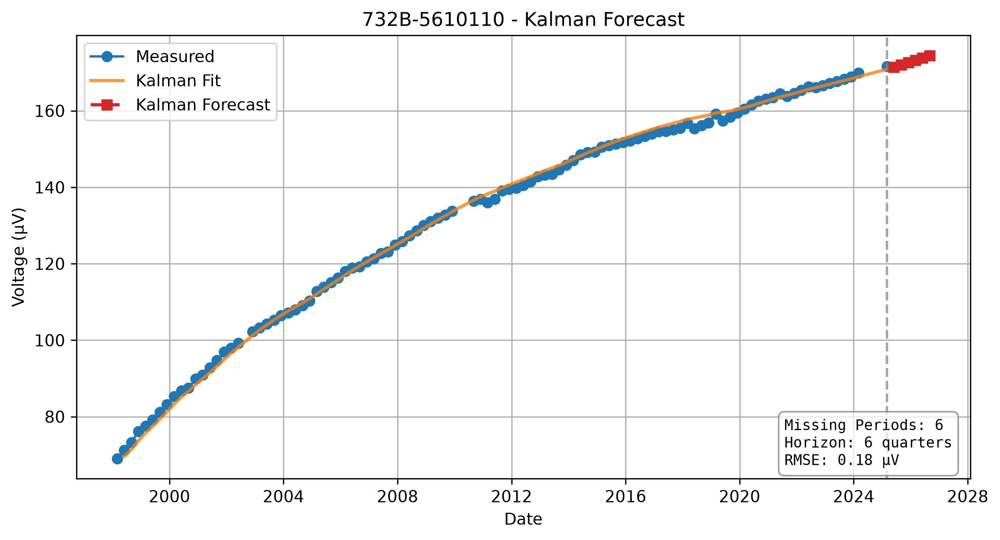

# ZenerEstimation

A modular framework for battery degradation analysis, forecasting, visualization, and experiment management.


## Documentation

- `docs/ARCHITECTURE.md` — Framework architecture
- `docs/DEVELOPMENT_HISTORY.md` — Sprint-by-sprint project evolution
- `docs/RELEASE_NOTES.md` — Version history


```markdown
## Forecast Examples

### ARIMA

| 732B-5610410 | 732B-5610110 |
|---|---|
|  |  |

### Kalman

| 732B-5610410 | 732B-5610110 |
|---|---|
|  |  |


The results/ directory is created automatically by demonstrations and stores generated experiment artifacts. It is excluded from version control.