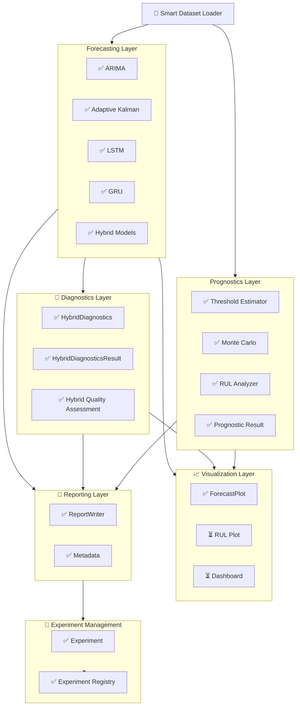

# ZenerEstimation Architecture

**Document** : ARCHITECTURE.md  
**Framework Version** : 0.10.0  
**Document Version** : 0.10.0  
**Status** : Active  
**Last Updated** : August 2026

---

# Related Documentation

| Document | Purpose |
|---|---|
| ARCHITECTURE.md | Current system architecture |
| DEVELOPMENT_HISTORY.md | Evolution of the framework |
| RELEASE_NOTES.md | Version-by-version changes |

---

# 1. Project Status

ZenerEstimation is an open-source Python framework for battery
voltage forecasting and Remaining Useful Life (RUL) estimation.

The framework provides forecasting, hybrid modeling, diagnostics,
visualization, reporting and experiment management under a common
modular architecture.

## Current Status

| Item | Status |
|---|:---:|
| Framework Version | **0.10.0** |
| Development Stage | Active |
| Classical Forecasting | ARIMA, Adaptive Kalman |
| Neural Forecasting | LSTM, GRU |
| Hybrid Forecasting | Kalman + LSTM |
| Hybrid Diagnostics | **Implemented** |
| Quality Assessment | **Implemented** |
| Forecast Visualization | **Implemented** |
| Experiment Management | **Implemented** |
| Prognostics | Threshold + Monte Carlo RUL |
| Unit Tests | **115 Passing** |

---

# 2. Project Vision

The primary objective of ZenerEstimation is to provide a modular,
extensible and reproducible framework for battery voltage prediction
and prognostics.

The framework is designed so that new forecasting algorithms,
hybrid models, diagnostic methods, visualization tools and prognostic
models can be integrated without modifying unrelated components.

The long-term objective is not only to generate forecasts, but also
to provide quantitative evidence explaining the quality, consistency
and trustworthiness of those forecasts.

---

# 3. Overall Architecture



---

# 4. Layered Architecture

## Data Layer

Responsible for:

- Smart dataset loading
- Dataset validation
- Missing-period reconstruction
- Frequency detection
- Standardized `BatteryDataset` objects
- Deterministic preprocessing

### Purpose

Every forecasting algorithm receives the same standardized dataset
representation.

---

## Forecasting Layer

Implemented forecasting models:

- `ARIMAForecaster`
- `AdaptiveKalmanFilter`
- `LSTMForecaster`
- `GRUForecaster`
- `BaseHybridForecaster`
- `KalmanLSTMForecaster`

### Purpose

Every forecasting model follows a common forecasting interface and
produces a standardized `ForecastResult`.

Hybrid models orchestrate existing forecasting components rather than
reimplementing their forecasting logic.

---

## Hybrid Forecasting Layer

The hybrid architecture currently supports decomposition-based
forecasting.

```text
                  Processed Dataset
                         │
                         ▼
                  ┌──────────────┐
                  │ Trend Model  │
                  │    Kalman    │
                  └──────┬───────┘
                         │
                         ▼
                  Trend Component
                         │
             ┌───────────┴───────────┐
             │                       │
             ▼                       ▼
       Original Signal          Residual
             │                       │
             │                       ▼
             │                ┌──────────────┐
             │                │ Residual LSTM│
             │                └──────┬───────┘
             │                       │
             │                       ▼
             │                Residual Forecast
             │                       │
             └───────────┬───────────┘
                         ▼
                 Combined Forecast
                         │
                         ▼
                  ForecastResult
```

The decomposition follows:

```text
Signal = Trend + Residual
```

The trend and residual components are retained by the hybrid model
for subsequent diagnostics.

---

# 5. Diagnostics Layer

The diagnostics layer was introduced during **Sprint 10**.

Its purpose is to analyze previously calculated forecasting results
without rerunning the forecasting models.

## Implemented Components

- `HybridDiagnostics`
- `HybridDiagnosticsResult`
- Hybrid decomposition verification
- Trend variance analysis
- Residual variance analysis
- Variance explained
- Residual mean
- Residual standard deviation
- Residual RMSE
- Lag-1 residual autocorrelation
- Durbin-Watson statistic
- Ljung-Box test
- Hybrid quality assessment
- Quality score
- Quality grade
- Diagnostic recommendations

---

## HybridDiagnostics

`HybridDiagnostics` analyzes the internal decomposition produced by a
hybrid forecasting model.

The main diagnostic relationship is:

```text
Trend + Residual = Original Signal
```

The decomposition is explicitly verified before higher-level quality
assessment is performed.

### Diagnostic outputs

The diagnostics layer evaluates:

| Diagnostic | Purpose |
|---|---|
| Decomposition verification | Confirms mathematical reconstruction |
| Trend variance | Measures variation represented by the trend |
| Residual variance | Measures unexplained variation |
| Variance explained | Measures how much signal variation is captured by the trend |
| Residual mean | Detects systematic residual bias |
| Residual standard deviation | Measures residual dispersion |
| Residual RMSE | Measures residual magnitude |
| Lag-1 autocorrelation | Detects short-term residual dependence |
| Durbin-Watson | Tests residual serial correlation |
| Ljung-Box | Tests residual whiteness |

---

# 6. Hybrid Quality Assessment

Hybrid quality assessment provides a compact interpretation of the
diagnostic results.

The objective is not to replace forecasting accuracy metrics, but to
answer whether the hybrid decomposition behaves consistently and
whether the residual model appears to have removed meaningful temporal
structure.

The assessment produces:

```text
Diagnostic Metrics
        │
        ▼
Quality Assessment
        │
        ├── Quality Score
        ├── Quality Grade
        └── Recommendations
```

The quality assessment considers the diagnostic evidence rather than
simply returning a numerical forecast error.

Typical recommendations may address:

- insufficient trend representation,
- excessive residual structure,
- residual autocorrelation,
- decomposition inconsistency,
- unstable hybrid behavior.

---

# 7. HybridDiagnosticsResult

`HybridDiagnosticsResult` provides a stable result object for
diagnostic consumers.

It separates diagnostic computation from presentation.

The result can be consumed by:

- Console output
- Reports
- JSON metadata
- Visualization
- Future dashboards
- Experiment comparison tools

Conceptually:

```text
HybridDiagnostics
        │
        ▼
HybridDiagnosticsResult
        │
        ├── summary()
        ├── to_dict()
        ├── quality score
        ├── quality grade
        └── recommendations
```

This follows the same architectural principle used by
`ForecastResult` and `PrognosticResult`.

---

# 8. Visualization Layer

## Implemented

- `ForecastPlot`

`ForecastPlot` displays:

- Historical measurements
- Model fitted values, when available
- Forecast values
- Forecast boundary
- Experiment information
- Forecast metadata

The visualization is experiment-aware and can associate the generated
figure with the registered experiment.

Hybrid diagnostics are currently exposed primarily through the
diagnostic/reporting workflow.

Future diagnostic-specific plots may be added without modifying the
forecasting layer.

---

# 9. Reporting Layer

## Implemented

- `ReportWriter`
- JSON metadata export
- Human-readable experiment reports

The report workflow now supports optional hybrid diagnostics.

```text
ForecastResult
      │
      ├──────────────┐
      │              │
      ▼              ▼
Forecast Report   Hybrid Diagnostics
      │              │
      └───────┬──────┘
              ▼
        ReportWriter
              │
              ▼
          results/
```

Hybrid diagnostics are optional in `ReportWriter`, preserving
backward compatibility with existing non-hybrid demos.

A hybrid report contains:

```text
Experiment
Dataset
Forecast
Hybrid Diagnostics
Quality Assessment
Recommendations
Model Metadata
```

---

# 10. Experiment Management

## Implemented

- `Experiment`
- `ExperimentRegistry`

Every experiment records:

- Experiment ID
- Battery
- Model
- Framework version
- Execution time
- Forecast horizon
- Artifact locations
- Model metadata
- Diagnostic metadata when available

The experiment ID is also displayed in the forecast visualization.

---

# 11. Result Storage

All generated experiment artifacts are stored under the centralized
`results/` directory.

A typical experiment produces:

```text
results/
    <battery>/
        <model>/

            figure.png

            report.txt

            metadata.json
```

The artifacts from a single experiment remain together.

The architecture deliberately avoids creating separate diagnostic
result directories. Diagnostics belong to the experiment that produced
them.

---

# 12. Data Processing Pipeline

All forecasting models operate on processed datasets.

```text
Raw Dataset
     │
     ▼
Validation
     │
     ▼
Missing Period Detection
     │
     ▼
Interpolation / Reconstruction
     │
     ▼
Processed BatteryDataset
     │
     ▼
Forecasting
     │
     ▼
ForecastResult
     │
     ▼
Diagnostics
     │
     ▼
HybridDiagnosticsResult
     │
     ▼
Visualization
     │
     ▼
Reporting
     │
     ▼
Experiment Registry
```

The preprocessing stage is deterministic and is performed before
forecasting.

Raw measurements remain separate from processed representations to
support reproducibility.

---

# 13. Architectural Principles

ZenerEstimation follows a layered architecture that separates
forecasting algorithms from preprocessing, diagnostics,
visualization, reporting and experiment management.

The framework follows these principles:

1. Every forecasting model exposes a common public API.

2. Forecasting models return standardized `ForecastResult` objects.

3. Hybrid models orchestrate existing forecasting components rather
   than duplicating forecasting logic.

4. Hybrid diagnostics analyze already-calculated model results and do
   not rerun forecasting unnecessarily.

5. Diagnostic results are represented by a dedicated
   `HybridDiagnosticsResult`.

6. Data preprocessing is deterministic and performed before
   forecasting.

7. Evaluation and diagnostics operate on stored result objects
   whenever possible.

8. Reporting is separated from numerical computation.

9. Visualization is separated from forecasting and diagnostics.

10. Experiment registration tracks generated artifacts and metadata.

11. Optional diagnostic functionality must not break existing
    forecasting demos.

12. Hyperparameter optimization remains an independent subsystem.

---

# 14. Framework Layers

```text
Data Layer
──────────
BatteryDataset
SmartDatasetLoader
Raw / Processed Datasets

        │
        ▼

Forecasting Layer
─────────────────
ARIMA
Adaptive Kalman
LSTM
GRU
Hybrid

        │
        ▼

Result Layer
────────────
ForecastResult
PrognosticResult
HybridDiagnosticsResult

        │
        ▼

Diagnostics Layer
─────────────────
HybridDiagnostics
Decomposition Verification
Residual Diagnostics
Quality Assessment

        │
        ▼

Visualization Layer
───────────────────
ForecastPlot
RUL Plot (planned)
Dashboard (planned)

        │
        ▼

Reporting Layer
───────────────
ReportWriter
JSON Metadata
Text Reports
PDF (planned)

        │
        ▼

Experiment Layer
────────────────
Experiment
ExperimentRegistry

        │
        ▼

Optimization Layer
──────────────────
Grid Search (planned)
Bayesian Search (planned)
AutoML (planned)
```

---

# 15. Sprint Roadmap

## Sprint 9 — Hybrid Forecasting Framework ✅ COMPLETED

### Goals

- Common hybrid forecasting architecture
- `BaseHybridForecaster`
- `LinearTrendLSTMForecaster`
- `KalmanLSTMForecaster`
- Trend forecasting
- Forecast combination
- Residual decomposition
- Forecast caching
- Hybrid demonstration
- Visualization improvements
- Experiment information overlay

### Deliverables

- Unified hybrid forecasting API
- Professional hybrid demonstrations
- Experiment-aware figures
- Centralized experiment artifacts
- Automated test coverage

**Status:** Completed

---

## Sprint 10 — Hybrid Diagnostics ✅ COMPLETED

### Objective

Provide scientific diagnostics and quality assessment for hybrid
forecasting models.

### Implemented Components

- `HybridDiagnostics`
- `HybridDiagnosticsResult`
- Residual diagnostics
- Trend/residual variance analysis
- Variance explained
- Decomposition verification
- Residual mean/std/RMSE
- Lag-1 autocorrelation
- Durbin-Watson statistic
- Ljung-Box test
- Hybrid quality assessment
- Quality score and grade
- Diagnostic recommendations
- Reporting integration
- Metadata integration
- Hybrid diagnostic demo

### Validation

**115 automated tests passing**

### Demonstration

The standard hybrid demo workflow now supports:

```text
Dataset
   ↓
Kalman + LSTM Forecast
   ↓
Hybrid Diagnostics
   ↓
Quality Assessment
   ↓
Forecast Plot
   ↓
Report
   ↓
Metadata
   ↓
Experiment Registry
```

Generated artifacts remain under the centralized `results/`
directory.

**Status:** Completed

---

# 16. Next Development Phase

## Sprint 11 — Forecast Quality & Comparison

### Objective

Build on the standardized result and diagnostics architecture to
compare forecasting models objectively.

### Planned Components

- Forecast comparison framework
- Cross-model RMSE / MAE / MAPE comparison
- Forecast stability analysis
- Model ranking
- Hybrid vs individual-model comparison
- Comparative reporting
- Comparative visualization

### Planned Inputs

```text
ForecastResult
HybridDiagnosticsResult
Experiment Metadata
```

### Planned Output

```text
ForecastComparison
       │
       ├── Accuracy
       ├── Stability
       ├── Diagnostics
       └── Ranking
```

**Status:** Planned

---

## Sprint 12 — Optimization & Automated Model Selection

### Planned Components

- Grid Search
- Bayesian Optimization
- Automated hyperparameter search
- Window selection
- Neural architecture selection
- Model selection
- Reproducible experiment tracking

**Status:** Planned

---

## Future Prognostics Expansion

The existing prognostics architecture includes:

- Threshold estimation
- Monte Carlo RUL
- RUL analysis
- `PrognosticResult`

Future work may integrate forecasting uncertainty and diagnostic
quality into RUL confidence assessment.

**Status:** Partially implemented / planned expansion

---

# 17. Architecture Status

ZenerEstimation has progressed from a forecasting-oriented framework
to a modular forecasting, diagnostics and prognostics framework.

The currently implemented architecture provides:

```text
                    ┌────────────────────┐
                    │   BatteryDataset   │
                    └─────────┬──────────┘
                              │
                              ▼
                    ┌────────────────────┐
                    │    Forecasting     │
                    │ ARIMA / KF / LSTM  │
                    │ GRU / Hybrid       │
                    └─────────┬──────────┘
                              │
                              ▼
                    ┌────────────────────┐
                    │   ForecastResult   │
                    └─────────┬──────────┘
                              │
                 ┌────────────┴────────────┐
                 │                         │
                 ▼                         ▼
        ┌─────────────────┐       ┌─────────────────┐
        │   Diagnostics   │       │   Prognostics   │
        │ Hybrid Quality  │       │ RUL / Threshold │
        └────────┬────────┘       └────────┬────────┘
                 │                         │
                 ▼                         ▼
        HybridDiagnosticsResult     PrognosticResult
                 │                         │
                 └────────────┬────────────┘
                              ▼
                    ┌────────────────────┐
                    │ Visualization /    │
                    │ Reporting          │
                    └─────────┬──────────┘
                              │
                              ▼
                    ┌────────────────────┐
                    │ ExperimentRegistry │
                    └────────────────────┘
```

The architecture is now sufficiently mature to support the next phase
of development: objective comparison and benchmarking of forecasting
models.

---

> ZenerEstimation is designed as a modular forecasting and prognostics
> framework in which data preparation, forecasting, hybrid modeling,
> diagnostics, Remaining Useful Life estimation, visualization,
> reporting and experiment management remain independent, reusable and
> interoperable components.