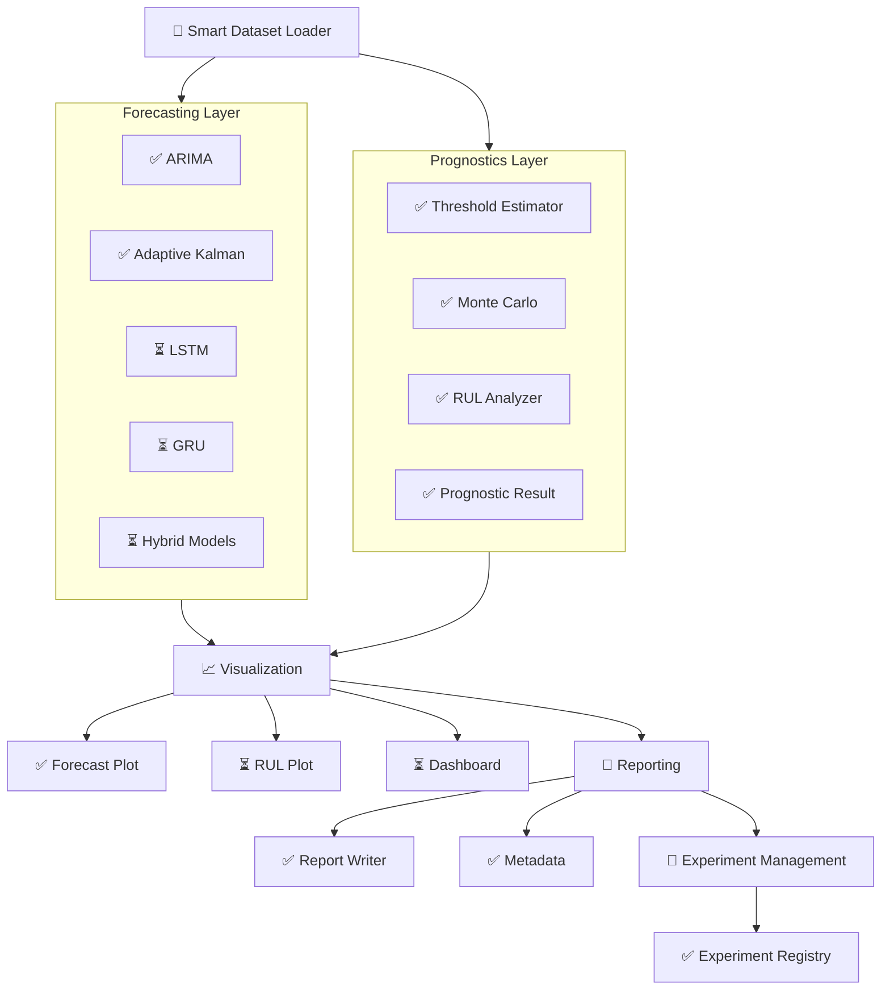
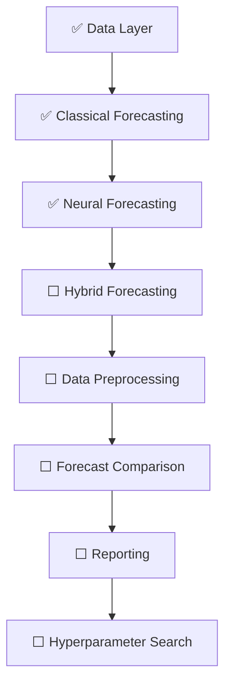

# ZenerEstimation Architecture

**Document** : ARCHITECTURE.md  
**Framework Version** : 0.8.1  
**Document Version** : 0.8.1  
**Status** : Active  
**Last Updated** : July 2026

---

# Related Documentation

| Document | Purpose |
|----------|---------|
| ARCHITECTURE.md | Current system architecture |
| DEVELOPMENT_HISTORY.md | Evolution of the framework |
| RELEASE_NOTES.md | Version-by-version changes |

---

# 1. Project Status

ZenerEstimation is an open-source Python framework for battery
voltage forecasting and Remaining Useful Life (RUL) estimation.

Current implementation includes both forecasting and prognostics
under a common modular architecture.

## Current Status

| Item | Status |
|------|:------:|
| Framework Version | **0.8.0** |
| Development Stage | Active |
| Forecasting Models | ARIMA, Adaptive Kalman, LSTM, GRU |
| Prognostics | Threshold + Monte Carlo RUL |
| Unit Tests | **69 Passing** |

---

# 2. Project Vision

The primary objective of ZenerEstimation is to provide a modular,
extensible and reproducible framework for battery voltage prediction
and prognostics.

The framework has been designed so that new forecasting algorithms,
visualization tools and prognostic models can be integrated without
modifying the existing architecture.

---

# 3. Overall Architecture



---

# 4. Layered Architecture

## Data Layer

Responsible for

- Smart dataset loading
- Validation
- Missing period reconstruction
- Frequency detection
- Standardized BatteryDataset objects

Purpose

Every forecasting algorithm receives identical prepared datasets.

---

## Forecasting Layer

Current

- ARIMAForecaster
- KalmanForecaster

Future

- LSTMForecaster
- GRUForecaster
- HybridForecaster

Purpose

Every forecasting algorithm returns a common ForecastResult.

---

## Prognostics Layer

Current

- ThresholdEstimator
- MonteCarloRUL
- RULAnalyzer
- PrognosticResult

Purpose

Separate Remaining Useful Life estimation from forecasting.

---

## Visualization Layer

Current

- ForecastPlot

Purpose

Generate publication-quality forecast figures.

---

## Reporting Layer

Current

- ReportWriter
- Metadata Export
- JSON Metadata

Purpose

Generate reproducible experiment outputs.

---

## Experiment Layer

Current

- Experiment
- ExperimentRegistry

Purpose

Track every executed experiment together with associated artifacts.

---

## 5. Architectural Principles

ZenerEstimation follows a layered architecture that separates
forecasting algorithms from preprocessing, evaluation and reporting.

The framework is built around the following principles:

1. Every forecasting model exposes the same public API.
   (`fit()`, `predict()`, `ForecastResult`)

2. Hybrid models orchestrate existing forecasting models rather
   than reimplementing forecasting logic.

3. Data preprocessing is deterministic and performed before
   forecasting.

4. Evaluation compares stored ForecastResult objects rather than
   rerunning forecasting models.

5. Hyperparameter optimization is implemented as an independent
   subsystem and never embedded inside forecasting models.

---

## 6. Framework Layers

```text
Data Layer
──────────
BatteryDataset
Raw Datasets
Processed Datasets

        │
        ▼

Forecasting Layer
─────────────────
ARIMA
Kalman
ETS
LSTM
GRU
Hybrid

        │
        ▼

Evaluation Layer
────────────────
ForecastResult
ForecastComparison

        │
        ▼

Reporting Layer
───────────────
JSON
Markdown
CSV
PDF (planned)

        │
        ▼

Optimization Layer
──────────────────
Grid Search (planned)
Bayesian Search (planned)

---


---

## 7. Hybrid Forecasting Architecture

Hybrid forecasting combines two independent forecasting models.

Trend Model
      │
      ▼
Residual Computation
      │
      ▼
Residual Model
      │
      ▼
Combined Forecast

---


---

## 8. Data Processing Pipeline

All forecasting models operate on processed datasets.

Raw Dataset
      │
      ▼
Validation
      │
      ▼
Interpolation
      │
      ▼
Processed Dataset
      │
      ▼
Forecasting
      │
      ▼
ForecastResult
      │
      ▼
Evaluation
      │
      ▼
Reports
```

The preprocessing stage is deterministic and therefore executed only
once for each dataset.

Processed datasets are stored separately from raw measurements to
ensure reproducibility.

---

## 9. Framework Roadmap

### Sprint 9

- ✅ Base Neural Infrastructure
- ✅ LSTM Forecaster
- ✅ GRU Forecaster
- ☐ BaseHybridForecaster
- ☐ KalmanLSTMForecaster
- ☐ ARIMALSTMForecaster (planned)

## Sprint 9 — Hybrid Forecasting Framework ✅ COMPLETED

### Goals
- Common hybrid forecasting architecture
- BaseHybridForecaster
- LinearTrendLSTMForecaster
- KalmanLSTMForecaster
- Trend forecasting
- Forecast combination
- Residual decomposition
- Forecast caching
- Hybrid demo
- Visualization improvements
- Experiment information overlay

### Deliverables
- Unified hybrid forecasting API
- Professional hybrid demonstrations
- Experiment-aware figures
- 88+ automated tests passing

**Status:** Completed


## Sprint 10 — Hybrid Diagnostics

### Objective

Provide scientific diagnostics for every hybrid forecasting model.

### Planned Components

- HybridDiagnostics
- ResidualDiagnostics
- TrendDiagnostics
- ForecastVerification
- DiagnosticReport

### Diagnostic Questions

The framework should automatically answer:

- How much variance is explained by the trend?
- How much improvement comes from the residual model?
- Are residuals approximately white noise?
- Is the decomposition mathematically correct?
- Is the trend stable?
- Is the forecast physically consistent?
- Can the forecast be trusted?

### Planned Outputs

- Diagnostic summary
- JSON report
- PDF report
- Console report
- Diagnostic plots

**Status:** Planned


Roadmap

✓ Sprint 1–8
✓ Sprint 9 — Hybrid Forecasting Framework

→ Sprint 10 — Hybrid Diagnostics

Future

- Benchmark Framework
- Forecast Confidence Intervals
- Remaining Useful Life (RUL)


### Sprint 11

- ☐ Data Preprocessing Pipeline
- ☐ Forecast Comparison Framework
- ☐ Reporting Framework

### Sprint 12

- ☐ Hyperparameter Optimization
- ☐ Bayesian Search
- ☐ Grid Search
- ☐ AutoML

---



---

### Architecture Status

This document describes the planned architecture of the
ZenerEstimation framework.

Implemented components and future milestones are documented together
to provide a stable architectural reference for future development.

The long-term goal is not only to generate forecasts, but also to provide quantitative evidence explaining why a forecast should be considered trustworthy.

---

# Related Documentation

| Document | Purpose |
|----------|---------|
| ARCHITECTURE.md | Current system architecture |
| DEVELOPMENT_HISTORY.md | Evolution of the framework |
| RELEASE_NOTES.md | Version-by-version changes |

---

> ZenerEstimation is designed as a modular forecasting and
> prognostics framework in which forecasting algorithms,
> Remaining Useful Life estimation, visualization,
> reporting and experiment management remain independent,
> reusable and interoperable components.